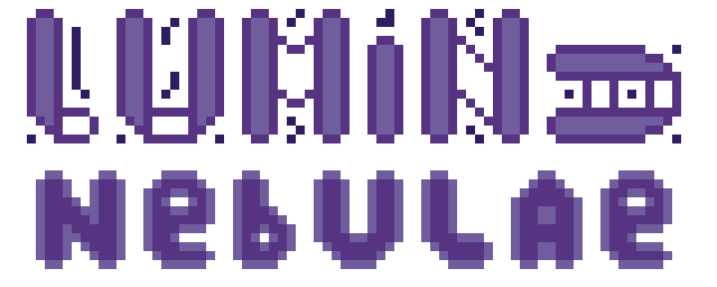
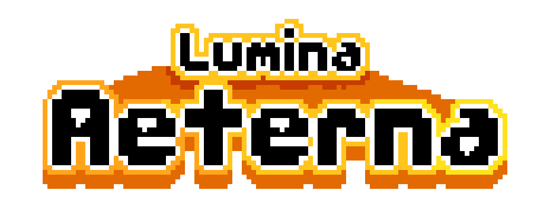

# **Project Lumina Products**

This page lists the main products connected to Project Lumina and their current development status.

---

## Seals of Lumina

- **Type:** tabletop role-playing game (TTRPG)
- **Status:** in development
- **Main format:** Logseq graph, PDF and possible physical edition

Seals of Lumina is a brand-new TTRPG system we’ve written from scratch. It features an innovative manual with tools for creating characters and campaigns, complete with original Project Lumina–themed rules

The first public release date is still to be determined. A limited group of beta testers is expected to play the game before the core rulebook is finalized. Future material may include additional manuals, ready-to-play adventures, and adjustments for different types of players.

---

## Garden 0

- **Type:** manga
- **Status:** published online, with limited physical editions
- **Creator:** [Zaffy](contributors.md)

Garden 0 is a manga created by [Zaffy](contributors.md). It uses an innovative pixel art style and features several characters connected to other Project Lumina products.

The manga is published in English as a free-to-read online release, with limited physical editions in Italian and English.

**Links**

- [Read Garden 0 on Manga Plus Creators](https://mangaplus-creators.jp/episodes/5d2607180550440027168580)
- [Read Garden 0 on Global Comix](https://globalcomix.com/c/garden-0)
- [Garden 0 dedicated Discord server](https://discord.gg/tgg7t82D95)

---

## Lumina Nebulae

- **Type:** RPG, 8-bit, horror, turn-based combat
- **Status:** in development
- **Creator:** [Melancholy](contributors.md)

Lumina Nebulae is a small RPG with horror/creepy elements. It explores themes such as anxiety, fear, and depression.

The game is expected to be released for free on itch.io. Its source code is already public on GitHub, and updates can be viewed and compiled, although no official release is currently available.

**Links**

- [Official itch.io page](https://melancholydev.itch.io/lumina-nebulae)

---

## Lumina Aeterna

- **Type:** RPG, bullet hell
- **Status:** on hold
- **Related page:** [Lumina Aeterna](Lumina%20Aeterna/index.md)

Lumina Aeterna follows a cultist who crash-lands on Earth after humanity has disappeared. The protagonist encounters strange creatures, some friendly and some hostile, while exploring several planets.

Development is currently paused so the team can focus on Seals of Lumina. Work may resume once the universe is more complete and the team has the skills, budget, and production capacity required for the project.

---

## Lumina Obscura

- **Type:** RPG, turn-based combat
- **Status:** planned
- **Related project:** Lumina Aeterna

Lumina Obscura is an RPG connected to the events of Lumina Aeterna. Development has not started yet and is expected to begin after Lumina Aeterna is finished.

The game is planned to include an original turn-based combat system with multiple characters, offering a broader view of the Project Lumina universe.
